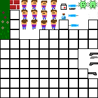
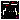
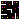
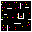

### Esse é CoronaVac!

No projeto prático do curso de Desenvolvimento de Games da Danki Code, desenvolvi em Java essa Game Engine para criação de jogos top down shooter e chamei o primeiro game de CoronaVac! 

##

Nesse primeiro game, implementei uma tela de menu com opção de iniciar novo jogo, carregar um save antigo ou fechar o jogo. O menu se encontra em um overlay preto com opacidade baixa, então a imagem de fundo e o próprio inicio do jogo. 
  

 

  
Fiz a pixel art na ferramenta Paint.Net e fiz a implementação dos comandos direcionais (WASD) e disparo (Botão do mouse ou 'X') e fiz a sincronização de direção pra alterar os frames a depender do local que você mira. 
  

 

  
Criei 3 fases/cenários com spawn fixo de inimigos, munição e life boxes.
 

 

  

 

  
Ao permitir o contato do inimigo (corona vírus), sua barra de vida diminue até dar Game Over se você não recuperar seu life por meio de life boxes.
  

 

  
##
  
Não tenho planos para mais implementações no momento, mas desejo no futuro voltar a desenvolver jogo. Espero que gostem do meu projetinho. Se tiver alguma dúvida sobre o funcionamento pode entrar em contato comigo via LinkedIn ou E-mail.
  
 

